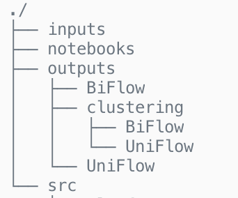

# Security Analytics

## Machine learning based cyberattack detection  

Note: To quickly see results go to notebook Summary.ipynb. 

## Structure of code
The code is structured as follows:  

*./:* The root folder contains quick access to Summary.pdf which contains the generation of final results including the attack file and Outliers.pdf which includes a visualizations of attackers and victims per each of the anomaly detection techniques, a zip file that contains the csv file with the attack data and access to SA_Assignment2_Report.pdf.  

*inputs:* Contains Uni-directional and bi-directional flow generated with splunk and python data transformations.  

*notebooks:* Contains the files summarizing clustering techniques, outliers identification and a summary of the attack. Note that there are two notebooks for clustering, one per flow, these two notebooks are the same, just differ in variables configurations to generate each flow features output.  

*outputs:* It has images and csv files with all the outputs from models for each of the flows and clustering techniques used.  

*src:* Contains all the source files used from notebooks. It is a set of helper functions to generate hte ouputs in an organized way.  

If code needs to be run, there are two options:  

## Run the clustering analysis and outliers results from the web.

Quickstart: 
1. Outliers per each of the clustering technique: https://github.com/danielgil1/security_analytics/blob/master/notebooks/outliers.ipynb
2. Summary DDoS Attack: Go to the repo https://github.com/danielgil1/security_analytics/blob/master/notebooks/Summary.ipynb
 

Go to the notebook folder and find the notebooks mentioned above you need to run it.

# Attack results

| Type | Start        | Finish       | Attackers                                                    | Victim        | Details                                                      |
| ---- | ------------ | ------------ | ------------------------------------------------------------ | ------------- | ------------------------------------------------------------ |
| DDoS | 17:14:05.497 | 19:16:12.201 | 162.242.240.67 169.54.33.166 146.20.128.223 146.20.128.189 151.101.192.194 13.59.43.55 104.16.26.35 13.58.146.190 104.117.102.33 107.22.224.100 104.97.137.26 | 192.168.10.50 | Stream ID, src_port and dst_port is detailed in the repository ddos.csv as several values are involved. |
